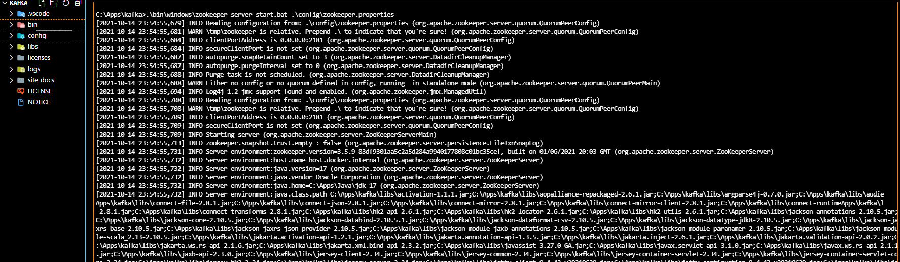
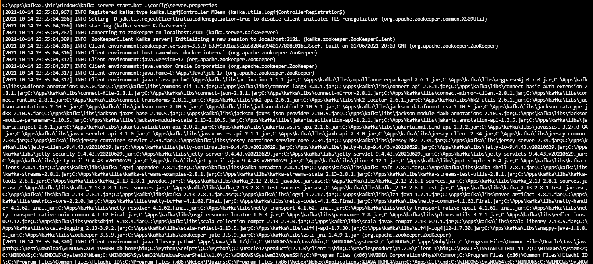
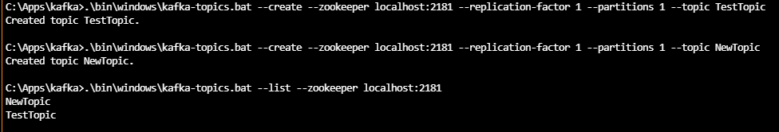
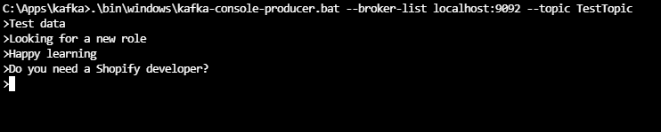
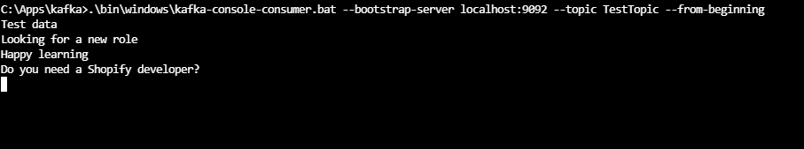

# Install Kafka on Windows 10

## Set up

kafka_2.13-3.0.0.tgz has issues.

c:\apps\kafka
c:\apps\kafka\server.properties
c:\apps\kafka\zookeeper.properties

```
.\bin\windows\zookeeper-server-start.bat .\config\zookeeper.properties
.\bin\windows\kafka-server-start.bat .\config\server.properties
.\bin\windows\kafka-topics.bat --create --zookeeper localhost:2181 --replication-factor 1 --partitions 1 --topic TestTopic
.\bin\windows\kafka-topics.bat --create --zookeeper localhost:2181 --replication-factor 1 --partitions 1 --topic NewTopic
.\bin\windows\kafka-topics.bat --list --zookeeper localhost:2181
.\bin\windows\kafka-console-producer.bat --broker-list localhost:9092 --topic TestTopic
.\bin\windows\kafka-console-consumer.bat --bootstrap-server localhost:9092 --topic TestTopic --from-beginning
```

## Knowledge Points

```
Kafka
Java
ZooKeeper
Messaging
Topic
Producer
Consumer
```

## Screenshot










