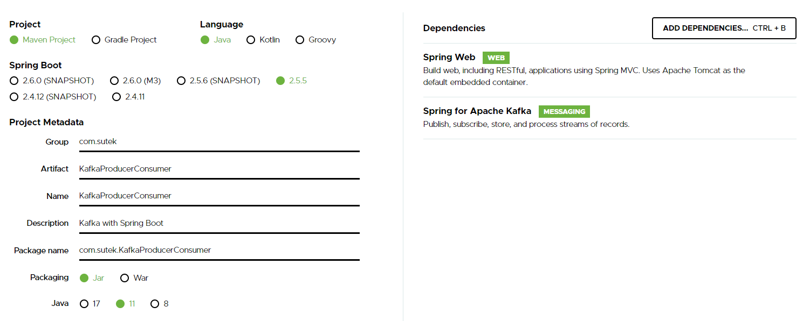
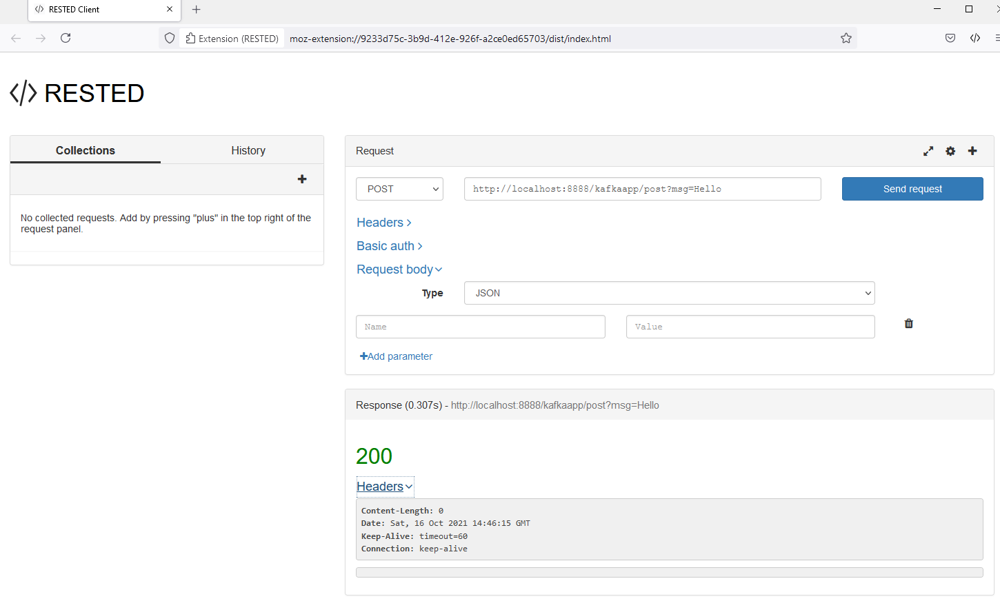
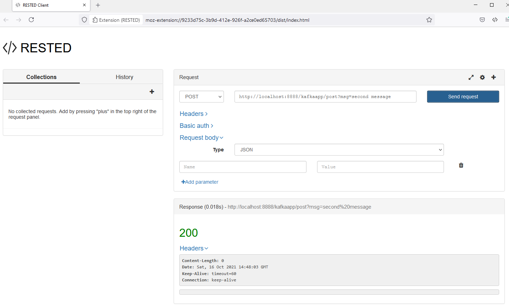
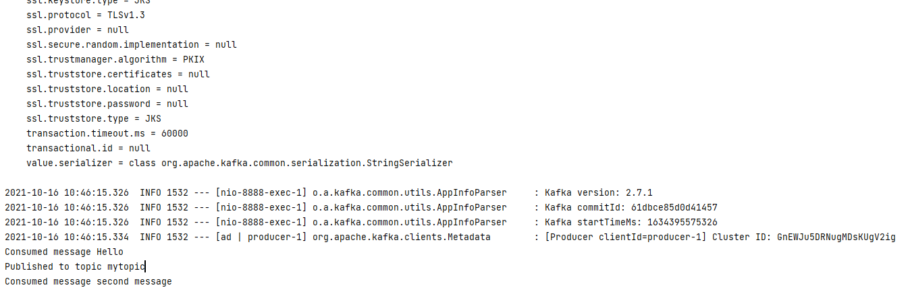

# Kafka with Spring Boot

## Set up

```
.\bin\windows\zookeeper-server-start.bat .\config\zookeeper.properties
.\bin\windows\kafka-server-start.bat .\config\server.properties
```

```
		<dependency>
			<groupId>org.springframework.boot</groupId>
			<artifactId>spring-boot-starter-web</artifactId>
		</dependency>
		<dependency>
			<groupId>org.springframework.kafka</groupId>
			<artifactId>spring-kafka</artifactId>
		</dependency>
```

```
POST
http://localhost:8888/kafkaapp/post?msg=Hello
```

## Knowledge Points

```
Kafka
Producer
Consumer
Java
Spring Boot
API to post messages
KafkaTemplate
Firefox RESTED plugin
```

Spring for Apache Kafka's KafkaTemplate is a thin wrapper around a Kafka producer that plays nicely with other Spring features, like dependency injection and automatic configuration. It provides a number of convenience methods for producing to Kafka topics.

## Screenshot








